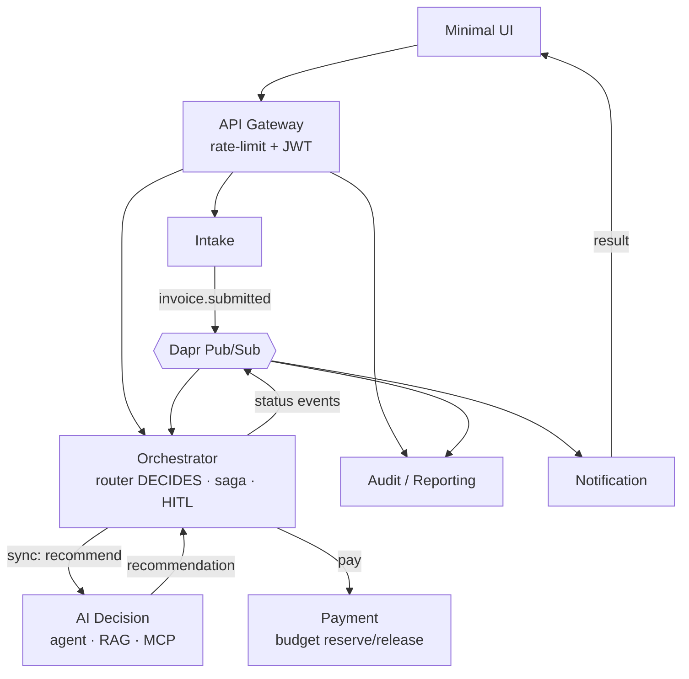

# ApprovalFlow — AI-Assisted Invoice & Expense Approval Platform

A microservice-based, AI-assisted SaaS that automates invoice/expense approvals at enterprise scale.
It **auto-approves the low-risk majority** and **escalates the unclear, risky, or high-value minority** to a
human — with a fully auditable decision trail and a payment flow that never double-pays or strands a reservation.

> Capstone for **Microservice Architecture** & **AI Engineering**.

## Status

🚧 Under active development. Design first: see **[docs/ARCHITECTURE.md](docs/ARCHITECTURE.md)**.

## Why it exists

Large enterprises drown in expense approvals — most are boring and safe, a few are genuinely risky.
ApprovalFlow lets an AI agent *recommend* a decision while a **deterministic router enforces policy**, so the
system is **provably incapable of auto-approving above the configured ceiling** — even when the model is wrong
or is adversarially steered by the payload.

## Architecture at a glance

Seven microservices over **Dapr**, brought up with a single `docker compose up`.



Full design, sequence & payment-saga diagrams: **[docs/ARCHITECTURE.md](docs/ARCHITECTURE.md)** ·
key decisions: **[docs/adr/](docs/adr/)** · the autonomy dilemma: **[docs/PRODUCT-DILEMMA.md](docs/PRODUCT-DILEMMA.md)**.

## Tech stack

| Concern | Choice |
|---|---|
| Language / web | Python 3.12 · FastAPI |
| Runtime / sidecar | Dapr — pub/sub, service invocation, state, secrets |
| Agent / AI | MAF (Microsoft Agent Framework) · swappable LLM provider |
| Messaging / state | Redis (Dapr pub/sub + state) |
| Data | PostgreSQL — database per service |
| Gateway | rate-limited single entry point |
| Observability | OpenTelemetry → Zipkin/Jaeger; structured logs + correlation id |
| Containers / CI | Docker · docker-compose · GitHub Actions |

## Run it locally

> Prerequisite: Docker Desktop (with WSL2 on Windows).

```bash
cp .env.example .env      # add your free-tier LLM key
docker compose up --build
```

## Test & verify

```bash
# One command runs the four worked journeys + the anti-cheese guards (D5).
# (wired up later in development)
```

## Repository layout

```
services/   the 7 microservices (gateway, intake, orchestrator, ai-decision, payment, notification, audit)
libs/       shared Python packages (schemas, logging, dapr & config helpers)
ui/         minimal web UI
dapr/       Dapr components (pubsub, statestore, secrets) + config
docs/       ARCHITECTURE.md, ADRs, PRODUCT-DILEMMA.md
eval/       labeled eval harness (B1)
verify/     one-command journey verification (D5)
infra/k8s/  Kubernetes manifests (B3)
```

## License

MIT — see [LICENSE](LICENSE).
