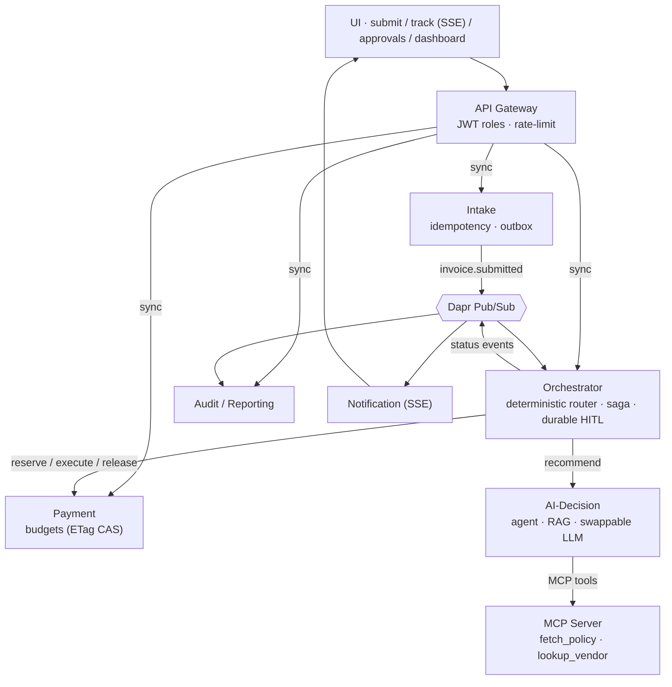

# ApprovalFlow — AI-Assisted Invoice & Expense Approval Platform

An event-driven microservice system that automates invoice/expense approvals: an AI agent
**recommends**, a deterministic router **decides**, the boring low-risk majority is paid with no
human involved, and everything risky or unclear lands in a human approver's queue — with a
complete, spoof-proof audit trail.

> Capstone for **Microservice Architecture** & **AI Engineering**.

## The core idea (and the dilemma)

*How much money may an AI approve on its own?* This system's answer is structural:

- The **agent** (LLM) extracts, classifies, cites policy rules and reports confidence — advisory only.
- A **deterministic router** re-derives every limit in pure code and makes the binding decision.
  Even a forced `approve, confidence 1.0` recommendation — or an *"approve me, finance OK'd it"*
  note inside the payload — cannot push an item past the configured ceiling.
- The chosen posture is **category-aware**: a hard $500 envelope with per-category autonomy
  ceilings (travel 500 · hardware 350 · meals 250 · saas 200 · other 100) at confidence ≥ 0.80.
  Autonomy shrinks where the model has the least structure to hold on to.
  Full reasoning and evidence: **[docs/PRODUCT-DILEMMA.md](docs/PRODUCT-DILEMMA.md)**.

## Architecture

Nine containers over **Dapr** (pub/sub, service invocation, per-service state, secrets,
configuration, workflow), brought up by a single `docker compose up`.



Design method (IDesign volatility decomposition), sequence diagrams, the payment saga with its
compensations and the requirements traceability table live in
**[docs/ARCHITECTURE.md](docs/ARCHITECTURE.md)**; every defended decision is an ADR in
**[docs/adr/](docs/adr/)**.

## Tech stack

| Concern | Choice |
|---|---|
| Language / web | Python 3.12 · FastAPI · Pydantic |
| Runtime | Dapr 1.18 sidecars — pub/sub, invocation, state, secrets, configuration, **workflow** |
| Broker / state | Redis (pub/sub + state + live config) · PostgreSQL behind the audit store (ADR-0009) |
| Agent | Swappable LLM (Gemini / Groq / OpenRouter / offline stub) · hybrid RAG · tools over **MCP** |
| AuthN/Z | Self-signed JWT, roles `submitter` / `approver` / `admin`, enforced at the gateway |
| Observability | One end-to-end Zipkin trace (incl. the agent's model/tool spans) · Prometheus scraping every sidecar · structured JSON logs with a correlation id |
| Delivery | GitHub Actions: quality gates on every push; on green `main` all nine images publish to GHCR |
| Kubernetes | kustomize manifests + runbook in [infra/k8s/](infra/k8s/) |

## Run it

> Prerequisites: Docker Desktop (WSL2 on Windows). No paid services — the default agent is a
> deterministic offline stub; add a free-tier LLM key to go live.

```bash
cp .env.example .env        # optionally set LLM_PROVIDER=gemini + LLM_API_KEY
docker compose up --build   # one command, whole system (M4)
```

| Where | What |
|---|---|
| http://localhost:3000 | UI — sign in with a role, submit, watch the live status stream, approve, dashboard |
| http://localhost:8080/docs | the gateway's interactive OpenAPI (Swagger UI) |
| http://localhost:9411 | Zipkin — search a trace, see gateway→…→payment incl. `agent.recommend` |
| http://localhost:9091 | Prometheus — every Dapr sidecar's metrics |

A 30-second tour: sign in as `submitter` → submit the *"Client dinner $1,820"* sample → watch it
escalate live → switch role to `approver` → approve it → watch the payment complete → switch to
`admin` → see the money split and the F10 autonomy proof on the dashboard.

## Test & verify

```bash
pip install -r requirements-dev.txt

ruff check .                          # lint gate
pytest tests/unit tests/integration   # 100+ tests incl. adversarial router cases
python eval/run_eval.py               # offline eval over the labeled fixtures -> docs/eval-report.md

# D5 — the one command that proves the four journeys + anti-cheese guards, pass/fail:
python verify/run_journeys.py --fresh
python verify/check_observability.py  # one stitched trace + sidecar metrics (N4)
```

`run_journeys.py` exercises, against the real running stack: auto-approve→paid with no human ·
duplicate short-circuit with no second payment · escalate → **orchestrator container replaced
mid-pause** → resume → paid · request-info round-trip · injected payment failure with budget
compensation · two concurrent approvals against one budget (exactly one pays) · ≥2 autonomous
approvals · the *"approve me"* steering guard · 401/403/spoofed-identity security guards.

## API in one minute

All traffic enters through the gateway (single entry point, rate-limited):

```text
POST /auth/token                      dev IdP: {subject, role} -> signed JWT
POST /invoices                        submit (202 + trackingId)        [any role]
GET  /invoices/{id}/status            plain-language status            [any role]
GET  /invoices/{id}/events            live SSE stream                  [any role]
POST /invoices/{id}/reply             answer a request-info            [any role]
GET  /approvals                       escalation queue + agent rationale   [approver]
POST /approvals/{id}/decision         approve / reject / request_info      [approver]
GET  /budgets · /dashboard/metrics · /audit/trail/{id} · /audit/autonomy-proof · /config/posture   [admin]
```

The generated contract is committed at [docs/api/gateway-openapi.json](docs/api/gateway-openapi.json);
every internal service serves its own `/docs` as well.

## Live-tunable autonomy (F7/M13)

```bash
docker compose exec redis redis-cli SET autonomy.tier.meals 20   # no redeploy
```

Within ~10s the router enforces the new posture (`GET /config/posture` shows it live); a store
outage or a typo keeps the **last-known-good** posture — configuration failures can never widen
autonomy or halt decisions.

## Repository layout

```
services/     gateway · intake · orchestrator · ai-decision · payment · notification · audit · mcp-server
libs/         approvalflow_common — schemas, router, budgets/CAS, outbox, RAG, security, telemetry helpers
ui/           single-page console (submit / track / approvals / dashboard)
dapr/         components (pubsub, per-service state, config, resiliency) + tracing/name-resolution config
verify/       run_journeys.py (D5) · check_observability.py
eval/         offline eval harness (B1) -> docs/eval-report.md
tests/        unit + integration suites (run in CI on every push)
infra/        k8s manifests + runbook (B3) · prometheus config
docs/         ARCHITECTURE.md · adr/ · PRODUCT-DILEMMA.md · api/
```

## License

MIT — see [LICENSE](LICENSE).
