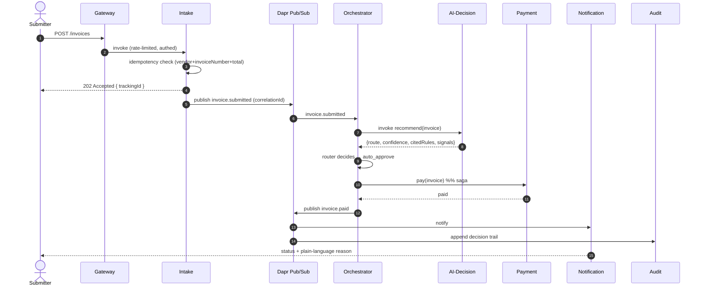
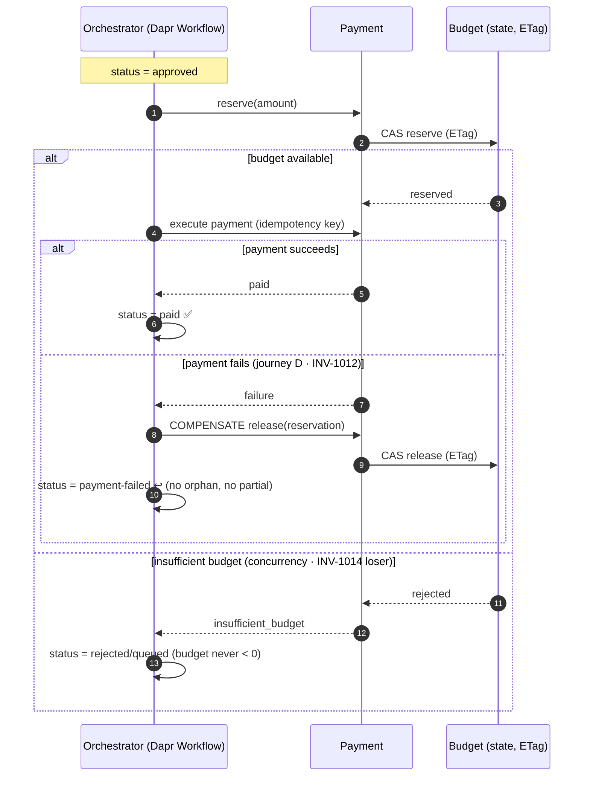
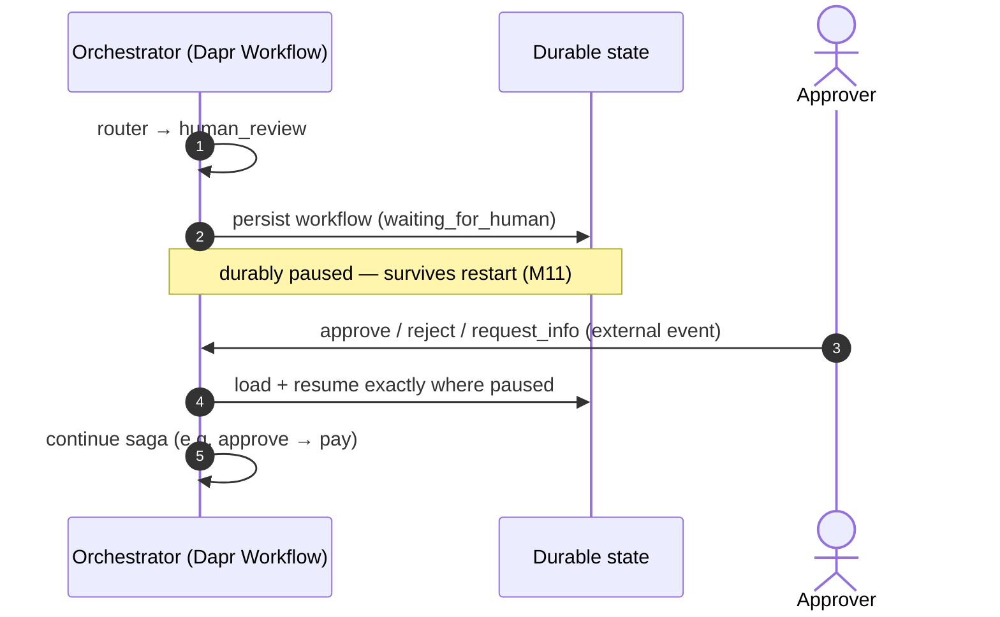

# ApprovalFlow — Architecture

> The high-level design and component boundaries, captured **before** writing code (D1).
> Diagrams are Mermaid so they render on GitHub.

## 1. Purpose & scope

ApprovalFlow ingests invoices/expenses, judges each one against a company policy with an AI agent, and routes it:

- **auto-approve** the low-risk majority (no human),
- **escalate** the unclear / risky / high-value minority to a human,
- then run an **auditable payment flow** with compensation on failure.

The product tension (the *dilemma*) is **how much autonomy the agent gets**. Our answer is structural: the agent
only **recommends**; a deterministic **router** makes the binding decision and **cannot be made** to auto-approve
above the configured ceiling (§5). That single idea drives the whole architecture.

## 2. Design method — decomposition by volatility (IDesign)

We decompose by **what changes independently**, not by function. A functional split ("an invoice service, a user
service, …") produces chatty services that must be deployed together — the anti-pattern the course warns about.
Instead we encapsulate each axis of volatility behind a service:

| Axis of change (volatility) | Encapsulated by | IDesign layer |
|---|---|---|
| How a request enters & is secured | `gateway` | Client |
| How items are received & acknowledged | `intake` | Client / Manager |
| How the approval *workflow* sequences | `orchestrator` | **Manager** |
| How the AI reasons (model, prompt, provider) | `ai-decision` | **Engine** |
| How policy rules & thresholds evaluate | router + external config | (within Orchestrator) |
| How payment & budget behave | `payment` | Engine + ResourceAccess |
| How results are delivered | `notification` | Engine |
| How decisions are recorded & reported | `audit` | Engine + ResourceAccess |

The IDesign heuristic — *few Managers, more Engines, almost-expendable services* — gives us **one** Manager
(the Orchestrator) coordinating several Engines.

## 3. Services & data ownership

Each service owns its own database (database-per-service) and shares **nothing** directly — communication is only
via Dapr.

| Service | Owns (private data) | Key requirements |
|---|---|---|
| `gateway` | — (stateless) | M6, N1 |
| `intake` | submissions, idempotency keys, outbox | F1, F3, M8, M10, N3 |
| `orchestrator` | workflow/saga state, escalation queue, decisions | F4–F6, F10, M9, M11, M12 |
| `ai-decision` | policy index (RAG), vendor list | F4, M15, N5, B2 |
| `payment` | payments, **budget reservations** | M9, M10 |
| `notification` | sent notifications | F2, M8 |
| `audit` | append-only decision trail, autonomy ledger | F8, F9, F10 |
| `mcp-server` | vendor master list, policy index (tool plane) | B2 |

```mermaid
flowchart TB
  subgraph Client
    UI["Minimal UI<br/>submit · status · approver · dashboard"]
  end
  UI --> GW["API Gateway<br/>rate-limit · JWT/roles"]

  GW -->|sync| INT["Intake"]
  GW -->|sync| ORCH["Orchestrator<br/>router DECIDES · saga · HITL"]
  GW -->|sync| AUD["Audit / Reporting"]

  INT -->|publish invoice.submitted| BUS{{"Dapr Pub/Sub (Redis)"}}
  BUS -->|subscribe| ORCH
  ORCH -->|sync invoke: recommend| AI["AI-Decision<br/>agent · RAG · MCP · swappable LLM"]
  AI -->|recommendation| ORCH
  ORCH -->|sync invoke: pay| PAY["Payment<br/>budget reserve/release"]
  ORCH -->|publish invoice.decided / .paid| BUS
  BUS -->|subscribe| NOTIF["Notification"]
  BUS -->|subscribe| AUD
  NOTIF -->|deliver result| UI

  AI -->|MCP tools: fetch_policy · lookup_vendor| MCPS["MCP Server (B2)"]

  ORCH -.->|state / secrets| DAPR[("Dapr state + secrets")]
  PAY  -.->|state ETag CAS| DAPR
  AI   -.->|secrets: LLM key| DAPR
```



## 4. Communication patterns (Dapr)

We use a **hybrid** of orchestration and choreography — the right tool per interaction:

| Interaction | Style | Dapr building block | Why |
|---|---|---|---|
| Gateway → service | sync | **Service invocation** | request/response with mTLS, retries, tracing |
| Intake → Orchestrator | async | **Pub/Sub** | decouple intake from processing (F1 never blocks) |
| Orchestrator → AI-Decision | sync | **Service invocation** | the workflow needs the recommendation to proceed |
| Orchestrator → Payment | sync (saga step) | **Service invocation** | each saga step is a request with a known outcome |
| Decisions / status fan-out | async | **Pub/Sub** | Notification + Audit react independently (choreography) |
| Thresholds & policy config | — | **Configuration / Secrets** | changeable without redeploy (M13/F7) |
| Workflow & budget durability | — | **State store** | durable pause/resume + ETag concurrency |

> **Orchestration for the transaction, choreography for the side-effects.** The money-moving saga is centrally
> orchestrated (easy to monitor and compensate); notifications and audit are choreographed off events (loosely
> coupled). This is the trade-off the course frames as "Orchestration vs Choreography".

## 5. The decision model — *agent recommends, router decides*

This is the heart of the system and the answer to the dilemma (M12, F10, F6).

```
            ┌─────────────────────────┐        ┌──────────────────────────────┐
 invoice →  │  AI-Decision (Engine)    │  reco  │  Deterministic Router        │ → final route
            │  extract · classify ·    │ ─────▶ │  (pure code, in Orchestrator)│
            │  confidence · cite rules │        │  re-checks every hard rule   │
            │  · fraud signals         │        │  against config thresholds   │
            └─────────────────────────┘        └──────────────────────────────┘
```

The agent returns a **recommendation** (typed/structured output): a proposed route, a `confidence` in `[0,1]`,
the `policy_violations[].rule_id` it cited, and any fraud `signals`. It is **advisory only**.

The **router** is deterministic code. Given the normalized invoice + the agent's recommendation + the current
config thresholds, it computes the binding route. An item is `auto_approve` **only if all hold**:

- USD amount **≤ its category's autonomy ceiling** — travel **$500** · hardware **$350** · meals
  **$250** · saas **$200** · other **$100** — every tier clamped by the absolute **$500 envelope**
  via `min(envelope, category)`, so no config can push machine-signing above $500,
- `confidence` **≥ `AUTONOMY-CONFIDENCE`** (default 0.80),
- policy-compliant for its category (SaaS ≤ $200/mo, HW ≤ $1,000, …),
- **no hard stop** fired.

The full posture and its justification live in [PRODUCT-DILEMMA.md](PRODUCT-DILEMMA.md).

Otherwise → `human_review` (or `reject` for a high-severity violation, `duplicate` for a re-submission).

**Hard stops always force a human, regardless of amount or confidence:** unknown vendor (`GLOBAL-VENDOR`),
FX over ceiling/$1,000 (`GLOBAL-FX`), math mismatch (`GLOBAL-MATH`), any fraud signal (`GLOBAL-FRAUD`),
missing required receipt (`GLOBAL-RECEIPT`), missing required info (`MEAL-01`/`MEAL-02`).

### Why the ceiling is *provable* (M12 / F10)

Because the router is pure, deterministic code that re-derives the route from the amount and the thresholds, the
agent **physically cannot** cause an auto-approval above the ceiling — even if it returns
`route = auto_approve, confidence = 1.0` for a $1,000,000 invoice, the router overrides it. We prove this with
unit tests that feed the router **adversarial agent outputs** (forced approvals, "approve me" notes) and assert
the route never violates the ceiling. The Audit service also keeps an **autonomy ledger** so an auditor can show,
over all processed items, that no auto-approval ever exceeded the limit.

### The four routes

| Route | Meaning | Example fixture |
|---|---|---|
| `auto_approve` | in-policy, under ceiling, confident, no hard stop | INV-1001, INV-1016, INV-1017 |
| `human_review` | over ceiling, low confidence, or a hard stop | INV-1003, INV-1009, INV-1011 |
| `reject` | high-severity violation (e.g. alcohol-only) | INV-1015 |
| `duplicate` | same vendor+invoiceNumber+total already processed | INV-1007 |

## 6. Worked journey — auto-approve (INV-1001)



## 7. Payment saga + compensation (M9)

The money-moving steps form an **orchestrated saga** run as a durable **Dapr Workflow** in the Orchestrator.
Each step has a compensating action; on failure we run compensations in reverse, leaving **no orphaned
reservation, no partial or double payment**.

| # | Forward step | Compensation (on later failure) |
|---|---|---|
| 1 | Mark invoice `approved` | Mark `payment-failed` |
| 2 | **Reserve budget** (ETag CAS on department budget) | **Release reservation** |
| 3 | **Execute payment** (idempotent, keyed by invoice id) | Void / mark reversed |
| 4 | Mark `paid` + publish `invoice.paid` | — (terminal success) |



**No-overspend under concurrency (INV-1014A/B):** the budget is a single state key updated with **ETag
compare-and-swap**. Two concurrent reservations both read the same ETag; the first write wins, the second gets a
conflict and is retried against fresh state — where it now sees insufficient funds and is rejected. The budget
can never go below zero.

## 8. Human-in-the-loop — durable pause/resume (M11, F5)

When the router returns `human_review`, the Orchestrator's workflow **durably persists** and waits for an
external event. The approver's `approve` / `reject` / `request_info` (via the Gateway) raises that event; the
workflow **resumes exactly where it paused** — even across a service restart, because the workflow state lives in
the Dapr state store, not in memory.



## 9. Cross-cutting concerns

- **Correlation id (M14, F9):** generated at intake, propagated on every Dapr call and pub/sub message, and
  stamped on every structured log line and OTel span — one id follows a request end-to-end, including the agent's
  model/tool calls.
- **Idempotency (M10, F3):** intake dedups on `vendor+invoiceNumber+total`; events carry a message id so
  redelivery is a no-op; payment is keyed by invoice id so retries pay exactly once.
- **Outbox (N3):** intake writes the submission and the outgoing event in one local transaction, then a relay
  publishes — no lost or phantom events.
- **Resilience (N3):** Dapr resiliency policies (timeout, retry with backoff, circuit breaker) on invocations;
  **bulkhead/throttling** at the gateway (rate-limit) and per-service concurrency limits.
- **Observability (N4):** OpenTelemetry traces + metrics exported to Zipkin/Jaeger; one end-to-end trace stitches
  the services **and** the agent's model/tool calls via the correlation id.
- **Security (N1):** self-signed JWT with roles `submitter` / `approver` / `admin`, verified at the gateway.
- **Config & secrets (M13, F7, M15):** thresholds and policy via Dapr configuration (hot-changeable); the LLM key
  via Dapr secrets; the LLM provider is selected by env/config and the agent fails **fast and loud** on provider
  errors (never silently).

## 10. Technology stack

| Concern | Choice |
|---|---|
| Language / web | Python 3.12 · FastAPI · Pydantic (typed I/O & structured agent output) |
| Runtime | Dapr 1.18 sidecars — pub/sub, invocation, state, secrets, configuration, workflow (+ placement & scheduler control-plane) |
| Agent | hand-rolled tool-calling loop · swappable LLM (Gemini/Groq/OpenRouter/offline stub) · tools over MCP |
| Broker / state | Redis behind per-service scoped Dapr state components; **PostgreSQL behind the audit component** — same state API, different database (ADR-0009) |
| Name resolution | Dapr sqlite resolver (shared registry) — mDNS proved unreliable on Docker networks |
| Observability | Zipkin traces (Dapr + app-level agent spans) · Prometheus scraping every sidecar · structured JSON logs + correlation id |
| Packaging | Docker · docker-compose (one-command up) · kustomize manifests for k8s (B3) |
| CI/CD | GitHub Actions — quality gates on every push; green `main` publishes all images to GHCR (N2) |
| UI | single-page console (submit · live SSE tracking · approver queue · dashboard) |

## 11. Design principles & the CAP posture

- **SOLID in practice:** one volatility per service; `AgentProvider`/`StateBackend` protocols make
  providers and stores swappable; the in-memory backend honors the exact CAS contract of the Dapr
  store, so concurrency guarantees are provable offline; the domain core (router, budgets) is pure
  code with no I/O, adapters point inward.
- **KISS / YAGNI, deliberately:** hybrid retrieval instead of a vector DB for a 15-rule policy
  (ADR-0007); a TTL-cached config read instead of subscription plumbing; per-service Dockerfiles
  duplicated on purpose — the price of independent deployability.
- **CAP, chosen per operation:** intake favors **availability** (a 202 is always immediate);
  status and reporting are **eventually consistent** projections of events; **money movements
  favor consistency** — ETag compare-and-swap that rejects rather than overspends. Where money
  moves, consistency beats availability; everywhere else, availability wins.

All key decisions are ADRs (`docs/adr/`): 0001 decomposition · 0002 Dapr Workflow ·
0003 router in-process · 0005 Redis broker · 0006 the autonomy posture (+
`PRODUCT-DILEMMA.md`) · 0007 RAG strategy · 0008 MCP server · 0009 data layer.

## 12. Requirements traceability

| Req | Where it lives |
|---|---|
| F1 async submit + tracking id | intake (202 + trackingId), pub/sub |
| F2 status + plain-language reason | gateway `/status`, notification |
| F3 no double-pay | intake idempotency, payment keyed by invoice id |
| F4 escalation queue + rationale | orchestrator queue, ai-decision structured output |
| F5 approve/reject/send-back + resume | orchestrator (Dapr Workflow external events) |
| F6 no needless rubber-stamping | router auto-approves the safe majority |
| F7 configurable policy/thresholds | Dapr config |
| F8 auto-vs-human dashboard | audit/reporting + UI |
| F9 full decision trail | audit, correlation id |
| F10 prove never above ceiling | deterministic router + autonomy ledger + tests |
| M3 ≥3 containerized services | 7 services, each a container |
| M4 one-command compose | `docker compose up` |
| M5 Dapr sync+async+state+secrets | §4 |
| M6 gateway + rate-limit | gateway |
| M7 minimal UI | ui |
| M8 async intake + notify | intake + notification |
| M9 consistent payment + compensation | §7 saga |
| M10 idempotency | §9 |
| M11 durable HITL | §8 |
| M12 provable ceiling | §5 |
| M13 external thresholds | Dapr config |
| M14 structured logs + correlation id | §9 |
| M15 clean code + provider ACL + fail-fast | ai-decision provider abstraction |
| M16/M17 CI + tests | GitHub Actions, tests/ |
| M18 README + diagram | README + this doc |
| N1 authn/z roles | gateway JWT |
| N2 CD | GitHub Actions publish |
| N3 outbox + bulkhead | intake outbox, gateway/throttling |
| N4 OTel + e2e trace | §9 |
| N5 RAG over policy | ai-decision |
| N6 tests across layers | tests/ (unit/integration/e2e) |
| B1 eval harness | eval/ |
| B2 MCP server | ai-decision tools over MCP |
| B3 Kubernetes | infra/k8s |
